# Scythe Reforged [? Levels, BOOM, DOOM 2]

# STATUS: 🧊FROZEN

The map was originally created for the Scythe Resharpened community project. But then the project fell apart and I took my map back. In the future, I plan to remake a few more maps and put it all out with the subtitle "Scythe: Reforged Demo". If people like it, I'll consider a full 32+ maps remake.

## Resources in use:
- [SCYTHE.WAD - Original Scythe Megawad](https://www.doomworld.com/idgames/levels/doom2/megawads/scythe)
- [ColossalDTex [8200+ Texture Pack]](https://github.com/Doom-Mapping-Modding-Lair-DRON12261/RES-ColossalDTex)

# Actual screenshots:
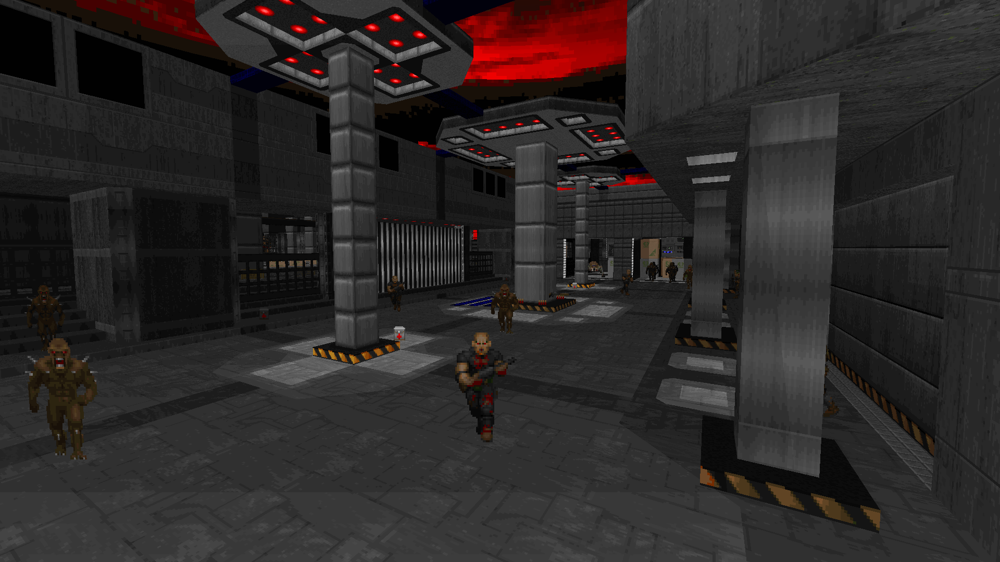

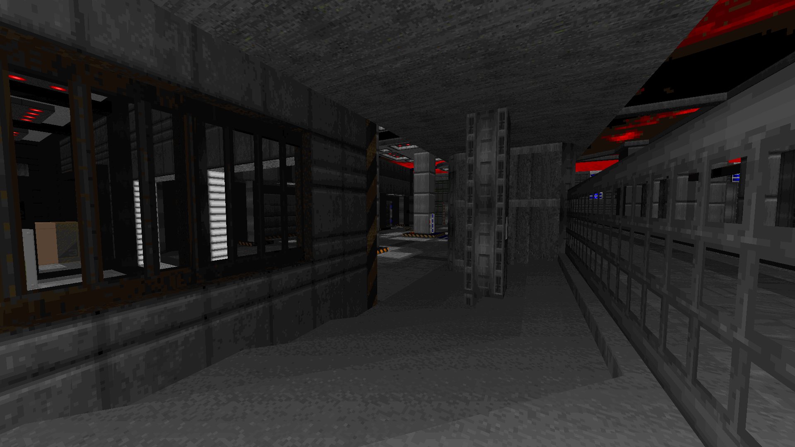
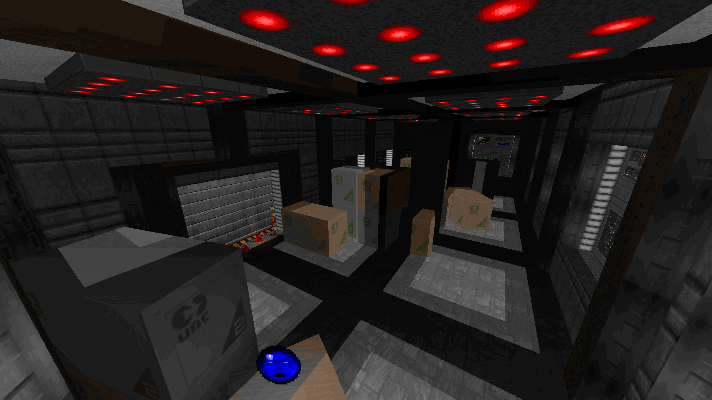
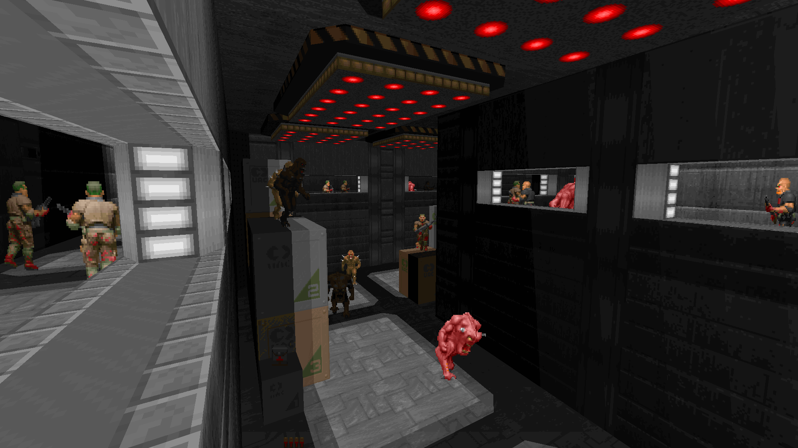
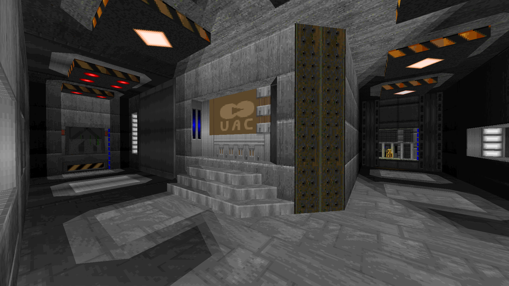
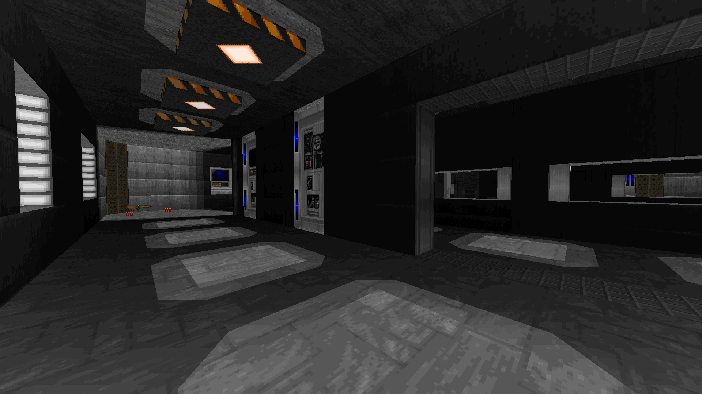
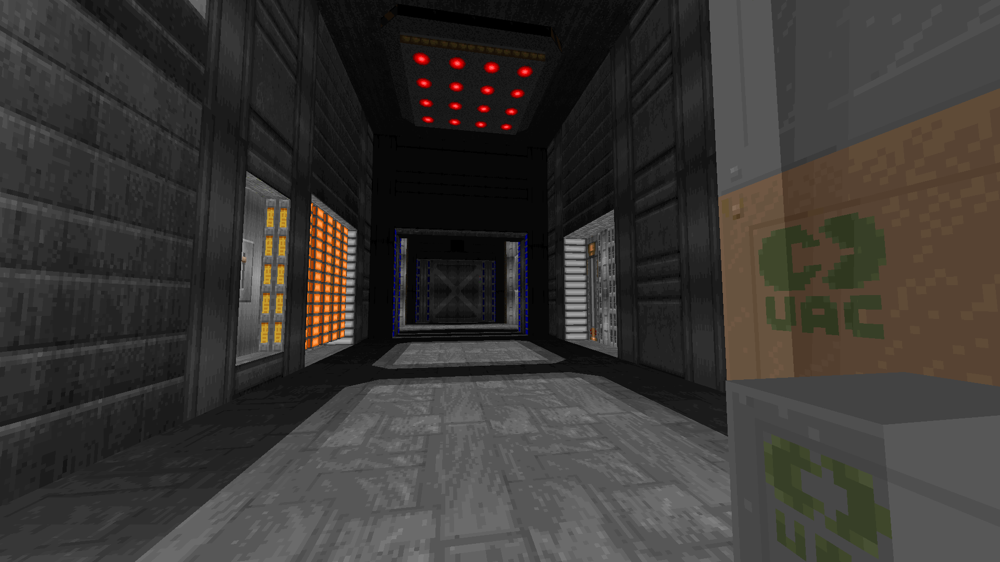
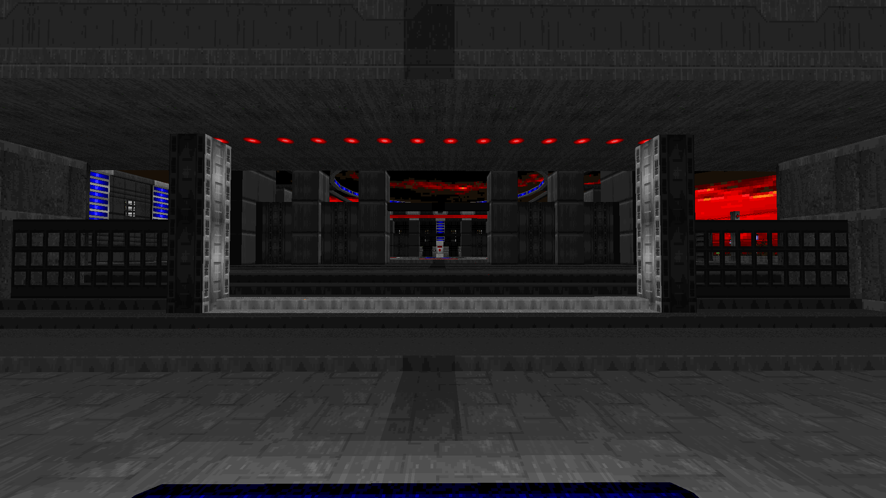
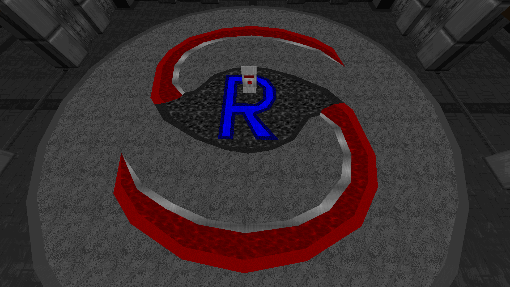
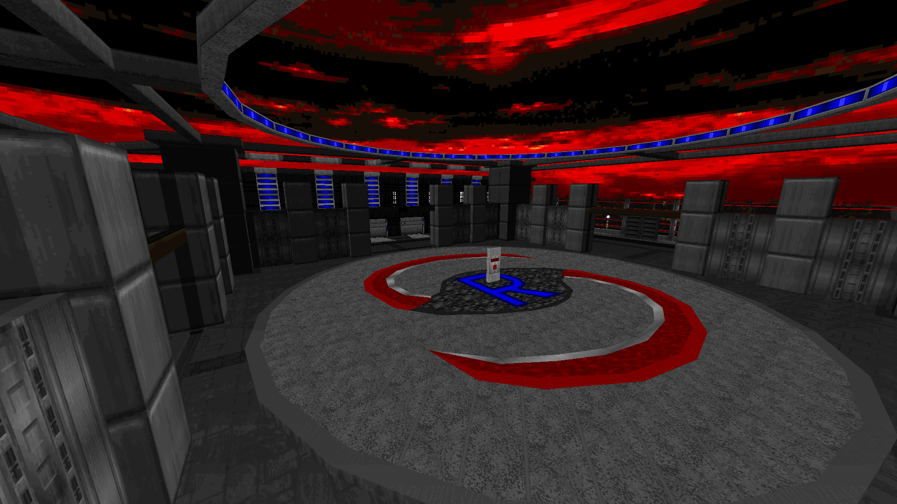
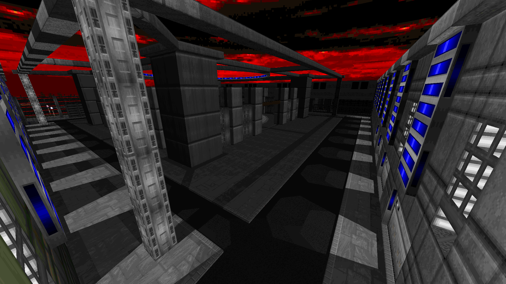
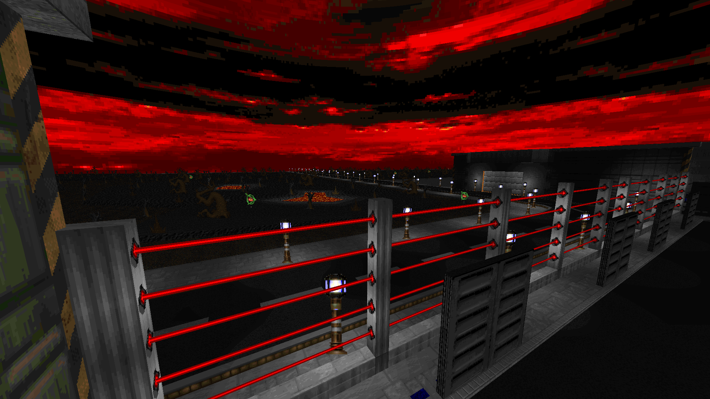
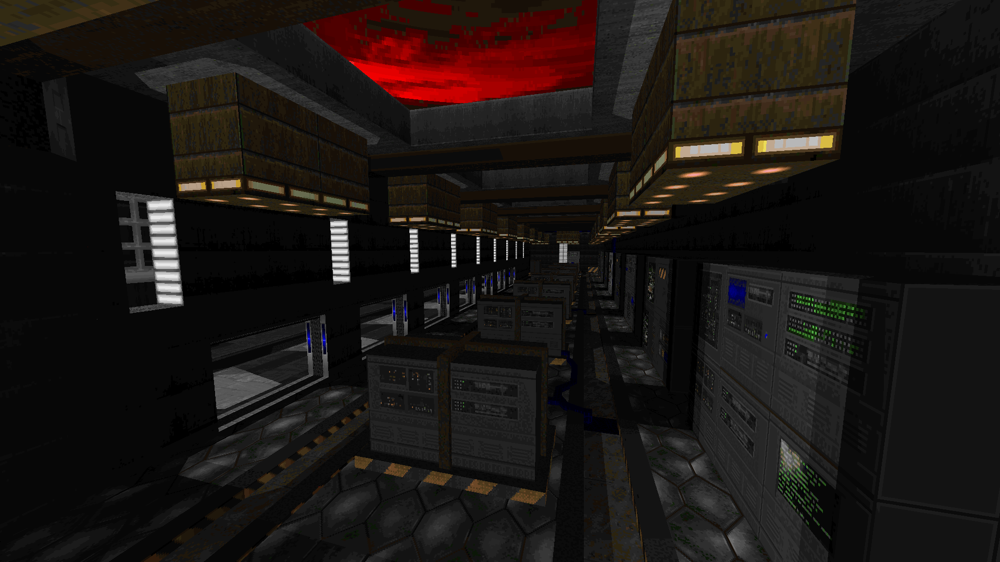
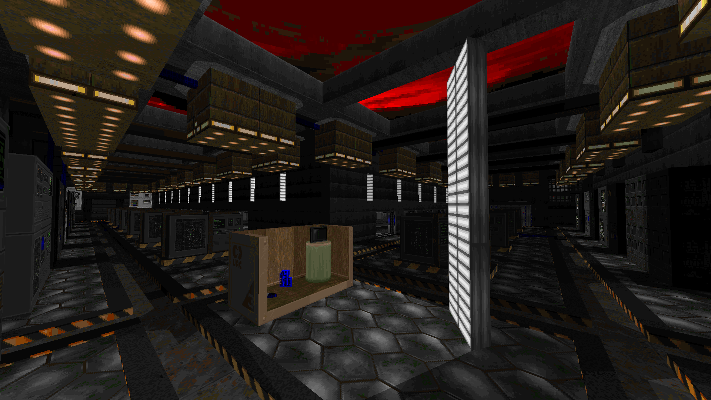
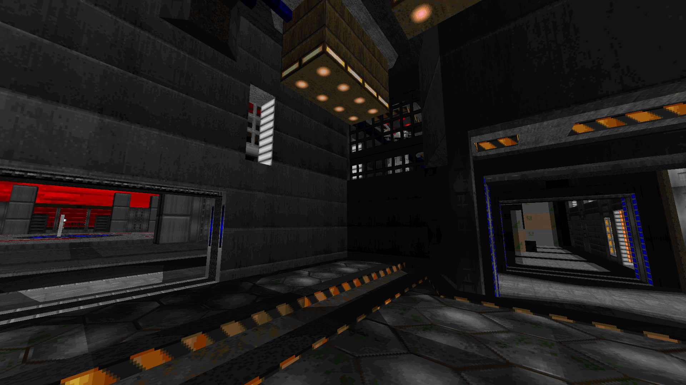
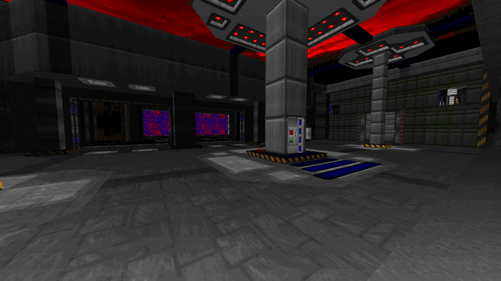
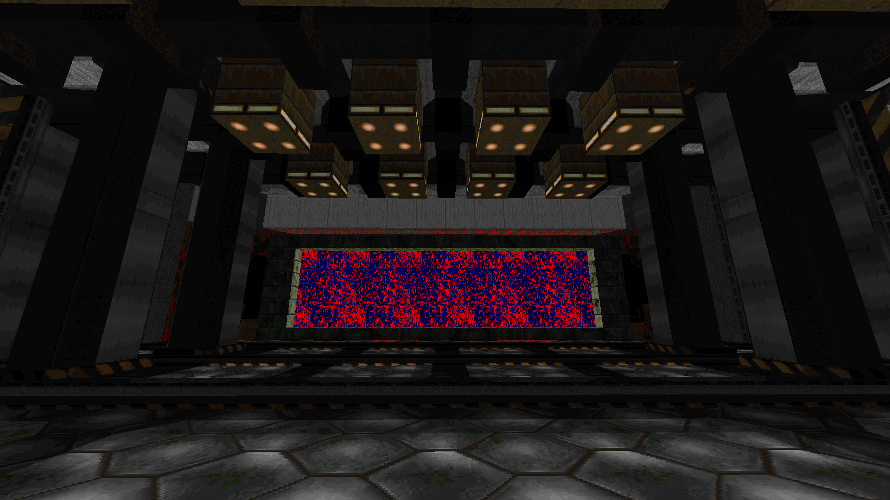
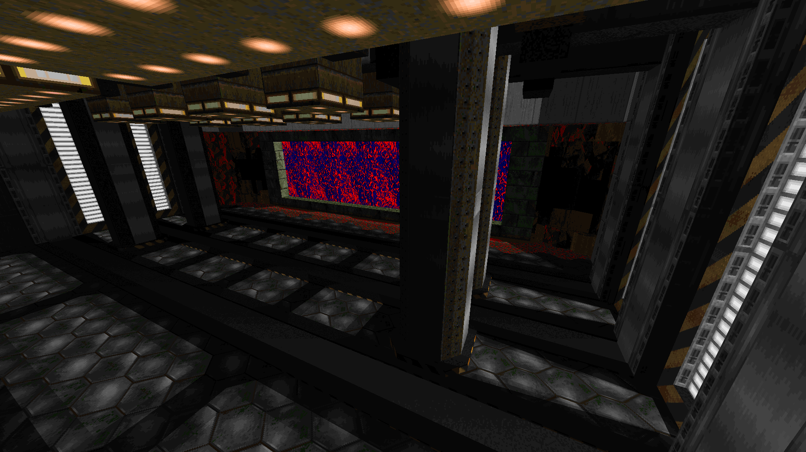
