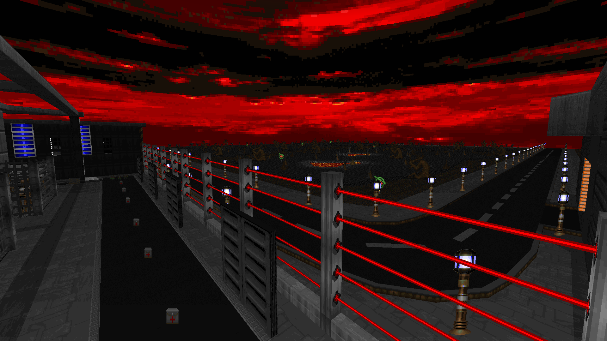
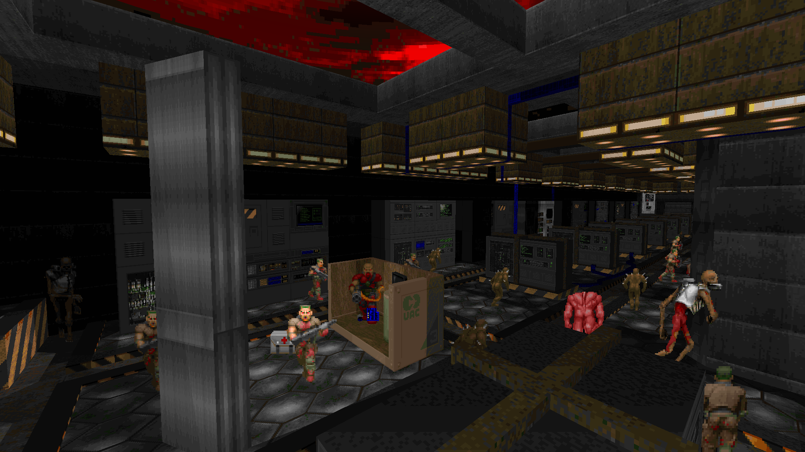

# Scythe Reforged [1+ Levels, BOOM, DOOM 2]

# STATUS: 📦EARLY RELEASE | MAP20 TEASER

### Download - [Latest Release](https://github.com/dron12261games/WAD-Scythe-Reforged/releases/download/teaser_v2/SCYTHER_TSER.ZIP)

The map was originally created for the Scythe Resharpened community project. But then the project fell apart and I took my map back. In the future, I plan to remake a few more maps and put it all out with the subtitle "Scythe: Reforged Demo". If people like it, I'll consider a full 32+ maps remake.

**DO NOT USE GZDOOM WITH HARDWARE RENDERER OR OTHER GRAPHICS MODS! THEY DISTORT THE PICTURE VERY BADLY, OFTEN COMPLETELY DESTROYING THE ENTIRE VISUAL OF THE MAP AND WORK WITH LIGHTING! THIS MAP IS INTENDED ONLY FOR DOOM SOURCE-PORTS WITH CORRECT SOFTWARE RENDERER, SUCH AS DSDA, WOOF!, NUGGET DOOM, DOOM RETRO, ETERNITY ENGINE, ETC.**

My goal is not just to improve the existing maps in the scythe. My goal is to create new levels from scratch, inspired by the original maps, keeping recognizability of setting, visuals, frame palette, special memorable moments, gameplay.

Update v2 (possibly final):
- fixed problem with progression after a boss fight
- added more ammo in the soul sphere secret
- minor fixes

## Resources in use:
- [SCYTHE.WAD - Original Scythe Megawad](https://www.doomworld.com/idgames/levels/doom2/megawads/scythe)

## MapList:
- `MAP20` - The Starport 2000 (on MAP01 slot in SCYTHER_TSER.WAD) ✅DONE

# Actual screenshots:

